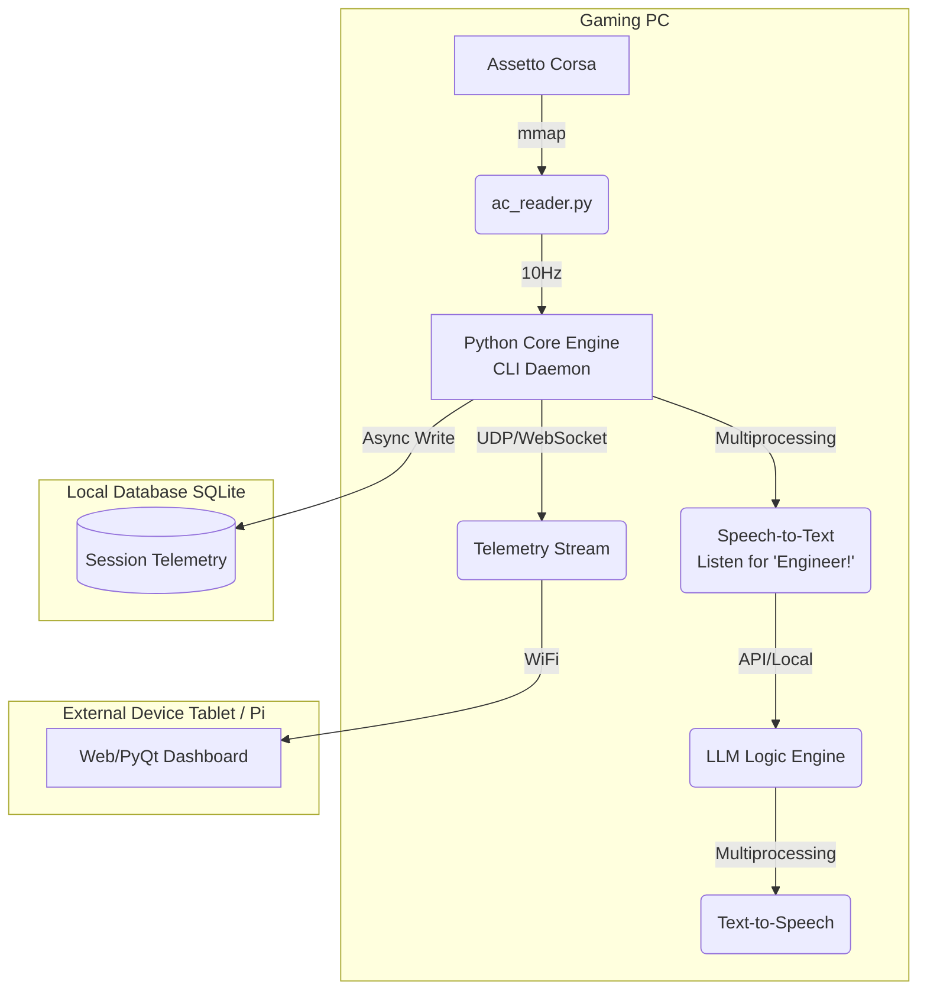

# 🎙️ Telemetry Coach V2 — AI Race Engineer

> An ultra-lightweight, command-line based AI Race Engineer for Assetto Corsa with two-way voice communication and an external telemetry display. 

---

## 🎯 The Vision

The goal of this project is to evolve from a basic telemetry dashboard into a **fully interactive AI Race Engineer**. 

Unlike bulky overlay apps that drain FPS, this system is designed as a **headless command-line application** that handles two-way voice communication (Speech-to-Text → LLM → Text-to-Speech) while offloading the visual dashboard to an **external display** (like a tablet or Raspberry Pi). 

This ensures **zero impact on game performance** while providing an immersive, F1-style engineering experience.

---

## 🏗️ System Architecture & Performance

To guarantee that the game's framerate is never impacted, the architecture relies on strict process isolation and network offloading.

### ⚡ Performance Considerations (Zero FPS Impact)
1. **Headless Core:** The main app runs in the terminal. No GUI rendering happens on the gaming PC.
2. **Multiprocessing:** Voice recognition (STT) and voice generation (TTS) run in isolated Python `multiprocessing` worker pools, preventing the 10Hz telemetry polling loop from ever blocking.
3. **External Display:** The visual dashboard is a lightweight web app (Flask+WebSockets) or a standalone PyQt app running on a secondary device (tablet, phone, or Raspberry Pi) on the local network.
4. **Efficient Storage:** Database writes (SQLite) are batched and executed asynchronously.

---

## 🗣️ Two-Way Voice Communication

The standout feature of this project is the ability to actually *talk* to your race engineer.

### How it works:
1. **Hotword Detection:** Runs a highly efficient local listener (e.g., `Porcupine` or `Vosk`) waiting for a wake word like *"Engineer"* or *"Bono"*. 
2. **Speech-to-Text (STT):** Captures the driver's command using `SpeechRecognition` or OpenAI Whisper (local/API).
3. **Contextual Logic (LLM):** Passes the command + *current live telemetry data* to a lightweight language model (or hardcoded logic engine) to formulate a response.
4. **Text-to-Speech (TTS):** Generates the audio response via `pyttsx3` or an ElevenLabs/OpenAI TTS API for ultra-realistic voices.

### Example Interactions:
- **Driver:** *"Engineer, what's my gap to the car behind?"*
- **Coach:** *"Gap behind is 2.4 seconds, he is lapping a tenth faster than you."*
- **Driver:** *"How are my tyre temps?"*
- **Coach:** *"Front left is slightly overheating, consider moving brake bias rearward."*
- **Driver:** *"Box this lap."*
- **Coach:** *"Understood, box confirm. We are switching to medium tyres."*

---

## 🗄️ Telemetry Storage & Analytics

All sessions are recorded to a local SQLite database for post-session analysis. 

### Database Schema Concept
- **`sessions`**: Track, Car, Date, Weather conditions.
- **`laps`**: Lap times, sector splits, total fuel used, max speed.
- **`frames`**: 10Hz raw data containing speed, RPM, throttle/brake, coordinates, and tyre wear.

### Post-Session Analysis
After the race, the CLI can generate a PDF report or launch a temporary web viewer to show:
1. **Lap Comparisons:** Throttle/Brake overlay of your fastest lap vs average lap.
2. **Tyre Degradation:** Wear and temperature curves over the stint.
3. **Consistency:** Sector time standard deviation.

---

## 🚀 Resume-Worthy Tech Stack

This project demonstrates advanced software engineering skills across multiple domains:

| Domain | Technologies Used | What it shows to an employer |
|---|---|---|
| **Systems Programming** | `ctypes`, Memory Mapping (`mmap`), `multiprocessing` | Low-level memory access, avoiding GIL bottlenecks, thread/process safety. |
| **Networking** | WebSockets (`websockets`), UDP streams | Real-time data streaming to external devices with minimal latency. |
| **AI / Audio** | `SpeechRecognition`, Whisper STT, `pyttsx3`, LLM APIs | Hands-free UI design, handling noisy audio inputs, prompt engineering with dynamic context. |
| **Databases** | `SQLite`, Batch processing | Designing time-series data schemas, asynchronous disk I/O. |
| **Data Science** | `pandas`, `matplotlib` (Post-race) | Transforming raw binary telemetry into actionable performance insights. |

---

## 🛣️ Roadmap

- **Phase 1 [Done]:** Reverse engineer C# shared memory structs to Python; build basic Tkinter local proof-of-concept.
- **Phase 2:** Strip GUI; convert to a headless CLI daemon streaming JSON telemetry over WebSockets to a mobile browser.
- **Phase 3:** Implement SQLite database for recording sessions and batch-writing 10Hz data.
- **Phase 4:** Integrate one-way audio alerts (TTS) based on telemetry thresholds (e.g., "Tyres cold").
- **Phase 5:** Integrate STT hotword detection for two-way driver queries.
- **Phase 6:** LLM integration for conversational, context-aware racing strategy.
